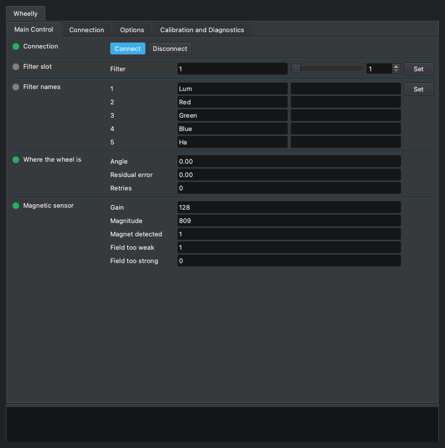
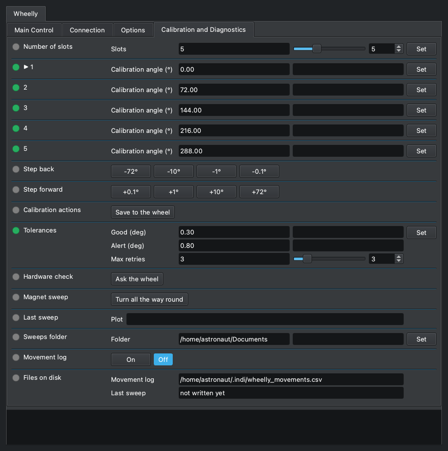

# Wheelly Filter Wheel

## Device Overview

Wheelly is an open-hardware motorisation for **manual** filter wheels: a NEMA 14
stepper turns the filter disc through a spring-loaded friction clutch, an AS5600
magnetic encoder on the wheel axis reads where the disc actually is, and a Seeed
XIAO ESP32-S3 runs the firmware and talks to this driver over USB. Nothing is cut
from the original wheel: the motorisation clamps around it.

The mechanics, the firmware, the wiring and the assembly guide are published at
[github.com/teoteo/Wheelly](https://github.com/teoteo/Wheelly). The reference
build is a five-position 2" wheel; the number of slots (2 to 12) and the angle
of each slot are stored in the wheel itself, so the same driver serves any
wheel the firmware has been set up for.

## Features

- Standard INDI filter wheel: filter slot, filter names, joystick.
- **Closed-loop positioning.** The position comes from the magnetic encoder,
  not from counting motor steps, so a slipping drive cannot put the wrong
  filter in the light path unnoticed. There is no homing: the position is
  absolute from power-on.
- Each move is judged against two tolerances. Within *Good* it is a success;
  between *Good* and *Alert* it is a success with a warning in the log, and
  imaging goes on; beyond *Alert* the wheel retries, and after the last retry
  the slot goes to Alert, which stops the Ekos sequence so that no frame is
  taken with the wheel out of place.
- Filter names are stored in the wheel and read at every connection, so a
  wheel moved to another computer keeps its names. Names are checked to be
  valid in FITS headers and file names; an empty field names the slot
  `Empty_<n>`.
- Calibration from the panel: step the wheel by one slot, 10°, 1° or 0.1° to
  centre a filter, press *Set* on that slot's row to teach the angle, then
  *Save to the wheel*.
- Motor run current, holding current at rest (0 = motor released, the
  default), hold after arrival, speed, acceleration, direction of travel and
  LED mode, all stored in the wheel.
- Diagnostics: the encoder's magnitude and flags at every poll, a hardware
  check that asks the firmware whether it can talk to the sensor and to the
  motor driver, a magnet sweep that turns the wheel once and sends a PNG plot
  of the field strength, and an optional CSV log of every filter change.
- A wheel is recognised by its serial number, not by its port: each profile
  remembers its own wheel, which matters with two wheels attached.

## Installation

The driver is part of INDI and needs no extra dependencies.

The wheel must run the Wheelly firmware of the same protocol version as the
driver. At connection the driver asks the firmware for its protocol version
and refuses any other, saying in the log which side to update.

The XIAO ESP32-S3 appears as a USB CDC serial port (`/dev/ttyACM0`). No UDEV
rule is needed, but the user running INDI must be allowed to open serial ports
(group `dialout` on Debian and Ubuntu, `uucp` on Arch).

## Configuration

1. Connect the wheel by USB.
2. In the Ekos profile, select **Wheelly** under Filter Wheels.
3. Connect. With INDI's *Auto Search* on (the default) the driver finds the
   wheel on its own; the baud rate does not matter, since the ESP32-S3 uses its
   native USB port.

*Main Control*: slot, filter names, where the wheel is (angle, residual error,
retries) and the magnetic sensor.

The first time, open **Calibration and Diagnostics**:

1. Set the number of slots, if it is not the one the wheel reports.
2. For each slot: choose it in *Filter slot*, centre the filter with *Step
   back* / *Step forward*, then press *Set* on that slot's row. The row shows
   the angle the wheel is at, marked with an asterisk until it is taught.
3. Press **Save to the wheel**. Until then every change lives in the wheel's
   working memory only, and switching the wheel off undoes it.

## Usage & Tips

- **The first thing to press when something is odd is *Hardware check*.** It
  does not move the wheel, and it tells whether the encoder and the TMC motor
  driver are answering. A loose wire on the motor driver otherwise looks like
  a mechanical problem.
- **Magnetic sensor.** *Magnitude* below 350 means the magnet is too far or off
  centre. The *Magnet sweep* measures it over a full turn: the smaller the
  variation, the better the magnet is centred. The plot is also written to the
  sweeps folder (default `~/Documents`).
- **Slipping or stalling.** Raise the run current in *Options → Motor* until the
  drive stops slipping, and no further. Very low speeds are weaker, not gentler:
  a small stepper has little torque there.
- **The wheel drifts at rest.** The log says so. Set a reduced holding current
  (150 mA is a good start) in *Options → Holding current at rest*.
- **Long filter changes.** Ekos gives up on a filter change after 30 s. If the
  motor settings or a one-way direction of travel could make a move longer, the
  log warns when they are set.
- **Movement log.** *Movement log → On* writes
  `~/.indi/wheelly_movements.csv`, one line per filter change: the residual
  error over a night or over months, to open in a spreadsheet.
- The complete description of every property is in the
  [control panel guide](https://teoteo.github.io/Wheelly/driver/).
