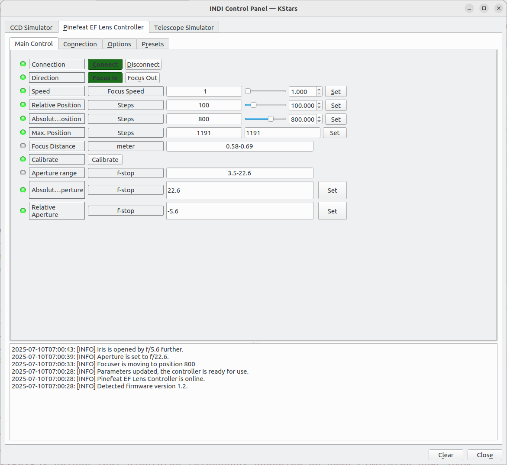

# EF / EF-S Lens Controller & Adapter for Astronomy Camera – Canon® Lens Compatible

[Pinefeat](https://www.pinefeat.co.uk) produces the adapter designed to interface between [Canon EF](https://www.canon.co.uk/store/ef-lenses/) & [EF-S lenses](https://www.canon.co.uk/store/ef-s-lenses/) and non-Canon camera bodies, incorporating features for electronic focus and aperture adjustments. The adapter has several variants: some have a built-in USB port, while others come with an external circuit control board featuring a serial connector. All variants provide a software programming interface that allows control of the lens's focus and aperture positions.

_Pinefeat_CEF_ is the INDI focuser driver that allows you to use the adapter with INDI platform. 

The solution allows **Canon EF** and **EF-S lenses** to be used for **astrophotography**. In addition to mechanical mounting, it provides electronic control of lens focus and aperture via astronomical imaging software.


## 🔗 Connecting the Adapter

The adapter with a USB port supports USB CDC (Communications Device Class) and emulates serial communication over USB. When connected, the USB device appears as a serial port on the host system.

If the adapter comes with an external circuit control board, the board will have a UART connector that uses 3.3V TTL logic. This can be connected to a single-board computer, such as a Raspberry Pi. When using a Raspberry Pi, the Serial Interface must be enabled in the Raspberry Pi configuration tool.

**Note**: Before connecting the lens, disconnect the adapter from the USB cable.

## 🧪 Quick test

The adapter features a **Self-Test Mode** to verify focus and aperture communication with the lens.

To activate Self-Test Mode, ensure the adapter is powered on, then toggle the **AF/MF switch** on the lens **three times within 15 seconds**. This will run a test sequence:
- _Focus Test_: moves focus from **minimum** to **infinity**, then back to **minimum** in **four steps**.
- _Aperture Test_: **closes** the aperture fully, then **reopens** it gradually in **four steps** to the maximum aperture.

[](https://youtu.be/-aLFMjMSr5M)

This sequence lasts for a few seconds and confirms that the adapter is communicating correctly with the lens.

Keep in mind that STM lenses are designed to be very quiet, and their focus movements are often smooth and hard to notice. If you're unsure whether the motor is working, try placing your ear close to the lens to listen for engagement.

If the lens does not complete any part of this sequence and the issue persists after repeated attempts, it indicates that the lens and adapter are not fully compatible. In such cases, some or all electronic functions (focus and/or aperture control) may not operate reliably.

Note: Self-Test Mode does not affect any camera or lens settings and can be safely repeated at any time.

## ⚙️ Running the driver

The driver is included in the INDI core package and does not require installation.

Start the INDI server with the focuser driver:

```shell
indiserver -v indi_pinefeat_cef_focus
```

## 🔧 Configuration

Open the INDI Control Panel and locate the _Pinefeat EF Lens Controller_ or _Pinefeat CEF_ tab.

The adapter's serial port should be detected automatically. If not, select the correct port on the _Connection_ tab.

On the _Main Control_ tab, click Connect. You should see the log like in the picture below.

**Important!** Upon connection, click _Calibrate_ at least once to determine total number of focus steps.



**Direction**: Focus IN or Focus OUT.

**Focus Speed**: If your lens supports this can set focus speed from 1 (lowest) to 4 (highest).

**Relative Position**: Set the number of steps from the current absolute position to move.

**Absolute Position**: Set the number of absolute steps.

**Maximum Position**: The maximum possible lens positions, which is required for autofocus algorithm.

**Focus Distance**: Displays approximate focus distance in meters.

**Calibrate**: The calibration procedure **must be run at least once** for each lens. No need to worry about the starting lens position. The driver will automatically traverse the full focus range, from minimum to infinity, and store the total number of focus steps in the configuration file. The determined value will be displayed in the _Max position_ text field (the one that is read only) in the Main Control tab. The one that is to the right is editable and allows you to override _Max position_ if the calibration fails for whatever reason. After setting up maximum position, absolute or relative sliders will move focus correctly.

**Aperture Range**: Displays lens aperture range in f-stops.

**Absolute Aperture**: Sets the camera's aperture to an f-stop value. Canon lenses do not report the current aperture, so aperture controls are write-only. If the lens aperture range is from f/5.6 to f/22.6, you can set the minimum aperture by passing `22.6` value, this will close the shutter as much as possible. To fully open the shutter, pass the value `5.6`. Any value in between will partially open the shutter.

**Relative Aperture**: Opens or closes the lens iris by a certain number of f-stops further. Positive values close the iris further, negative values open it further.

In zoom lenses, the aperture range varies as the focal length changes. The controller will check the possible maximum and minimum aperture values before sending the value to the lens. If the values are out of range, the lens will not engage. The relative control value will take effect if the absolute one has been set at least once after the focal length has been changed.

## 🔭 Using the Focuser with Ekos Focus Module

Ensure that you have **completed** the one-time **calibration** for the lens.

Once the focuser is configured via the INDI Control Panel, it can be used directly in the Ekos Focus Module.

1. Open the **Focus** tab in Ekos.
3. Select the _Pinefeat EF Lens Controller_ from the dropdown (it should be auto-detected if connected).
5. Set the exposure, binning, and algorithm parameters as needed for your setup.
7. Click Auto Focus to begin autofocus. Ekos will move the lens and calculate optimal focus based on star HFR.

Refer to the [Ekos Focus Module documentation](https://docs.kde.org/trunk5/en/kstars/kstars/ekos-focus.html) for detailed information on focusing algorithms and settings.

## 💡 Troubleshooting

If you're experiencing issues with the setup or the adapter, please refer to our [troubleshooting guide](troubleshooting.md) for more help.
